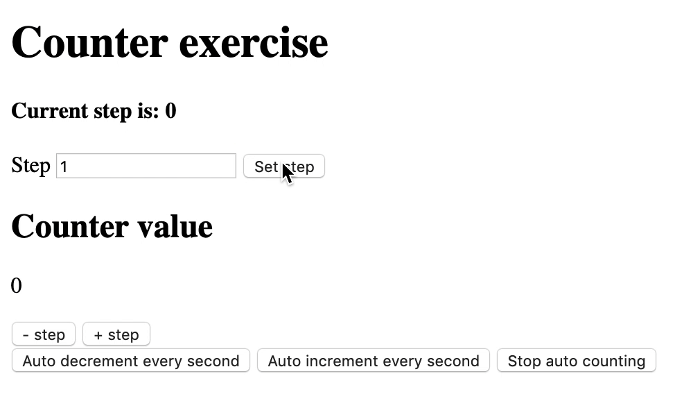

# Counters

You're tasked with recreating the functionality in this GIF. Try to break it down and think about all the different steps, then follow the example descriptions, keep testing the functionality in the browser and run the tests to check everything is working correctly.
